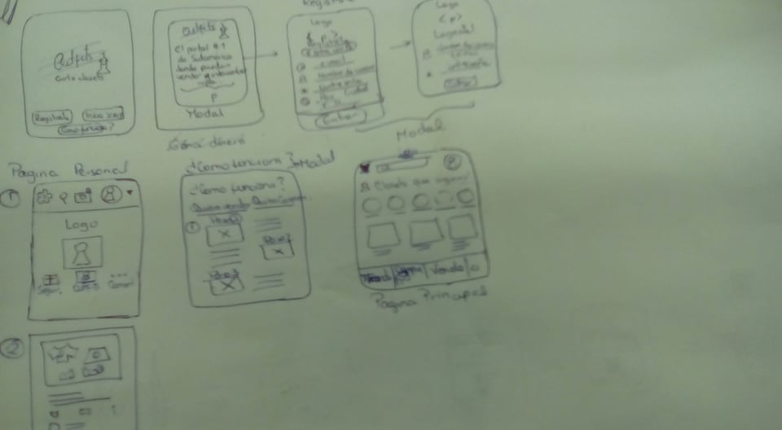
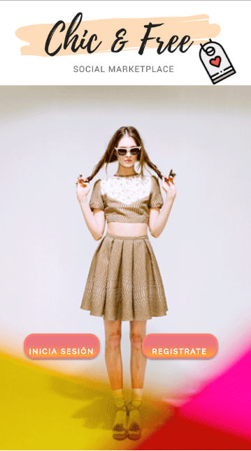
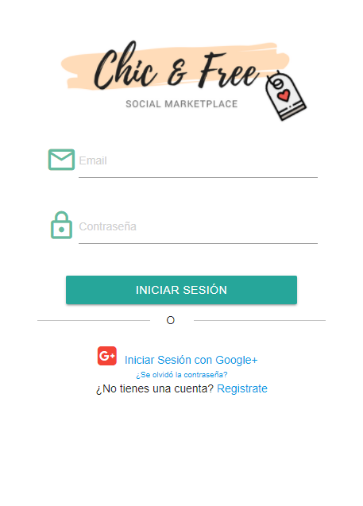
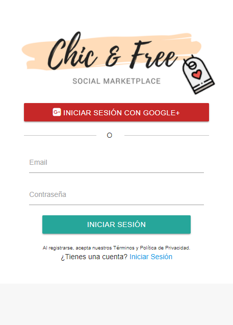
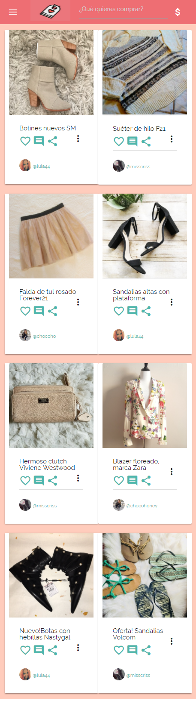
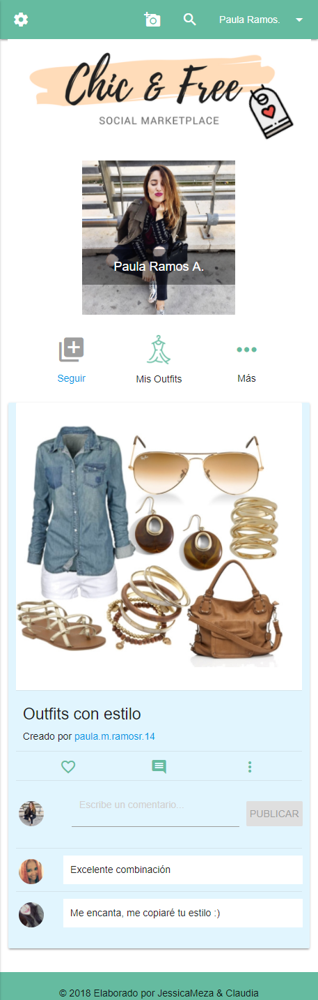
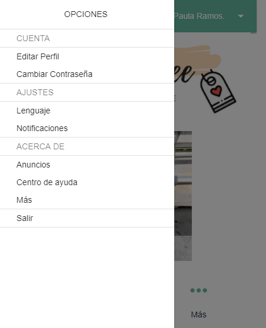
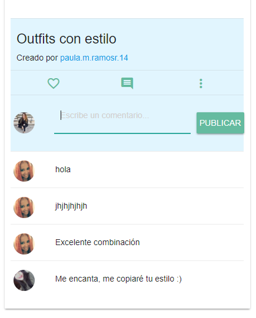
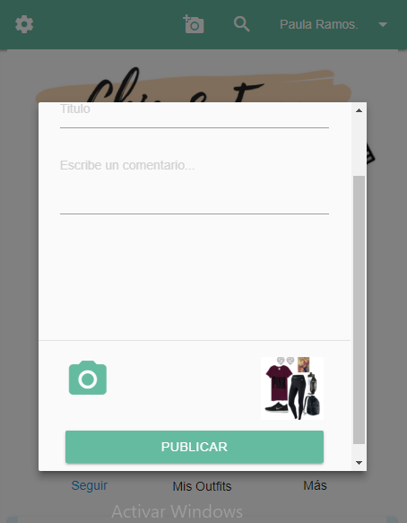

# Reto Final : Creacion de una Red Social

    Un emprendedor muy visionario nos ha encargado la creacion de una Red Social,a nuestro libre albedrio, pero asegurandonos que sera exitosa.

## Requerimientos:
   Para él hay algunos puntos básicos que debe tener una red social:

* Perfiles de usuarios
* Un newsfeed donde puedes ver las actualizaciones de todos tus contactos
* Un lugar donde poder escribir posts
* Un lugar para subir fotos
* Capacidad para poder tener amigos o para poder seguir a personas/marcas dentro de la red social
* Ser mobile friendly

## Proceso:

**1. Creacion del personaje:** 

   **Fecha:** 06 de enero

    "Laura es una mujer publicista de 26 años, le gusta la moda y vestirse bien y de una forma comoda ya que es una chica que realiza muchas actividades en el dia a dia. Va al trabajo en bicicleta porque esta muy consciente del cuidado del medio ambiente y los fines de semana saliendo del trabajo suele reunirse con amigos.

    Pero, Laura tiene un problema, se esta quedando sin espacio en su closet debido a la cantidad acumulada de ropa que ya no usa y otras prendas que jamas las usó.

    Ella busca que hacer con ellas y en ocasiones las ha regalado, ha donado, quizo venderlas tambien pero no obtuvo exito, ya que no se sentia comoda ofreciendolas a su circulo cercano porque sentia que era mejor regalarles que venderles y no sabia de la existencia de algun lugar que sea confiable para vender su ropa y que sea a un precio justo."

**2. Identificando el Problema:**

    **Fecha:** 06 de enero
   
    Según las estadísticas, aproximadamente el 30% de la ropa que tenemos en nuestro closet no la usamos, generando problemas de espaciodesorden.
    
**3. Generando las soluciones:**

   **Fecha:** 07 de enero

    Crear una red social en la cual se pueda vender, comprar e intercambiar ropa que se encuentre en buen estado, de esta forma liberandote de espacio en el closet y de ropa que ya no usas, fomentando tambien el consumo responsable.

**4. Sketch:**

    **Fecha:** 07 de enero

    Primer bosquejo de la aplicacion para version movil.

    

**5.Maquetacion en HTML 5:**

    **Fecha:** 08 - 10 de enero

    Empezamos a maquetar las vistas que en total fueron 5, entre ellas el index, la vista de Iniciar Sesion, Registrarse y para estas dos ultimas vistas pudimos lograr el registro con Google.
    También creamos una vista de actualizacion de noticias (News Feed) y la vista para el Perfil del Usuario.

    Vista Index:
    

    Vista Log In:
    

    Vista Sign Up:
    

    Vista News Feed:
    

    Vista User Profile:
    
    
    

**6. Diseño con "Materialize":**

    **Fecha:** 08 - 10 de enero

    Utilizamos Materialize debido a su simplicidad y diseño. Usamos una paleta de colores pasteles.

**7. Agregando funcionalidades con jQuery:**

    **Fecha:** 09-10 de enero

    Usamos jQuery para el modal para publicar las ofertas de ropa y otro modal que permite contactarse con la vendedora.

    
    

    Usamos Firebase para autenticar la contraseña con Gmail.
    
    

**8. Preparandonos para la exposicion de Chic & Fre**

    **Fecha:** 09 de enero

Para ello hicimos una pequeña presentación explicando el problema de un usuario ficticio y las posibles soluciones que creamos.Enfocandonos en el proceso de UX.

    



